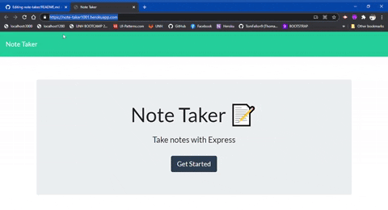
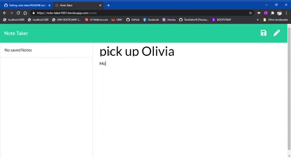
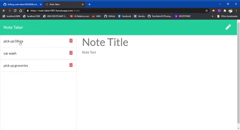

# Note Taker

Built with Express

URL of the deployed application: .herokuapp.com

URL of the GitHub repository: https://github.com/tomfallon9/note-taker

## Table of Contents 

* [Description](#description)
* [Acceptance Criteria](#acceptance-criteria)
* [View](#view)
* [Usage](#usage)
* [Built With](#built-with)
* [Credits](#credits)
* [License](#license)

## Description

This application can be used to write, save, and delete notes and uses an express backend and save and retrieve note data from a JSON file. Can be used to organize, update, and when done, delete notes when needed.

### Acceptance Criteria

- [x] App allows users to create and save notes.
- [x] App allows users to view previously saved notes.
- [x] App should allow users to delete previously saved notes.

## View

To view the website, you can click [here](https://note-taker1001.herokuapp.com/).

## Usage

In this application, the user can write, save, view, and delete notes. The following gif demonstrates application functionality.

## Built With

* [Express](https://expressjs.com/) - A Node.js web application server framework used to build web applications. 

## Credits
Unit 11 UNH Coding Bootcamp materials 
Front End files provided by ©Trilogy Education Services, a 2U, Inc. brand. All Rights Reserved.

